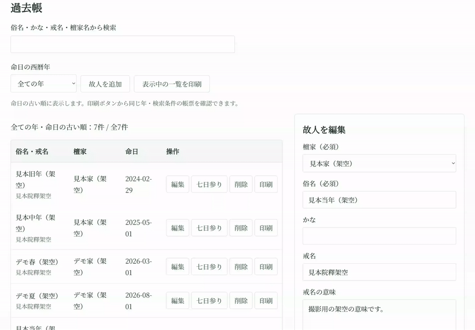
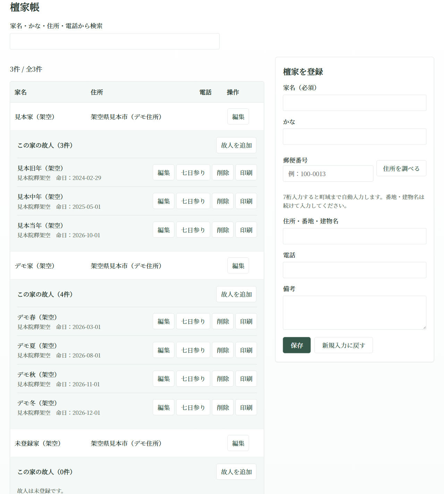
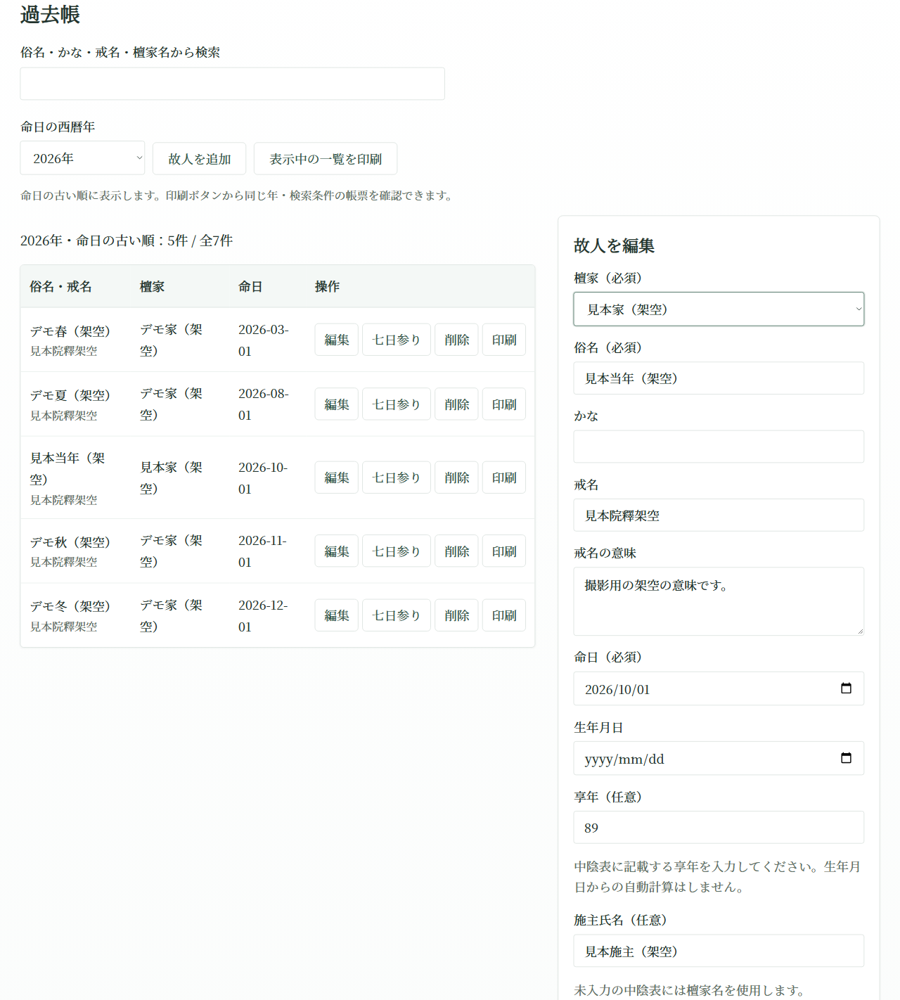
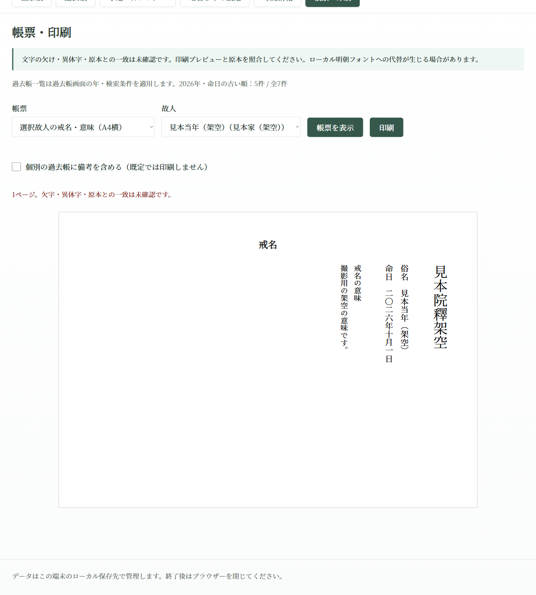

# 寺務帳

寺務帳は、日本の寺院向けに設計された最小限の寺務管理システムです。檀家帳・過去帳の管理、法要日の自動計算、縦書きA4帳票の印刷、月間予定および六曜の管理を完全ローカル環境で提供します。

## サンプル画面

以下はすべて撮影用の架空データです。実際の寺院・檀家・故人の情報は含まれていません。

### 操作動画（約9秒）

過去帳を2026年に絞り込み、故人行の「印刷」からA4横の中陰表を確認する操作です。撮影ではブラウザーの印刷ダイアログを省略し、アプリ内の帳票プレビューを表示しています。



[操作動画をMP4で見る](docs/videos/deceased-print-demo.mp4)

### 家ごとの故人一覧



### 年別過去帳と戒名の意味入力欄



### 年で絞り込んだ過去帳一覧の印刷


### 戒名と意味のA4横縦書き帳票



### 故人行から印刷する中陰表（A4横）


## 特長

- **完全ローカル稼働・依存パッケージなし**
  - Python 3.11 以上の標準ライブラリのみで起動します（追加の `pip install` 不要）。
  - アプリは外部CDN、外部解析、AIサービス、住所検索APIへの接続を必要としません。遠隔利用時はTailscaleの接続を使います。
- **SQLiteによるデータ管理**
  - データはローカルの `data/temple.sqlite3` に保存されます。
  - フロントエンドとバックエンドの通信には、ブラウザAPI形式のJSONのみを使用します。
- **家ごとの故人管理と年別過去帳**
  - 檀家帳の各家の下に、紐付く故人を命日順で表示します。その家を選んだ状態で追加でき、一覧から編集・削除できます。
  - 過去帳は命日の古い順に並び、西暦年と検索語で絞り込めます。「表示中の一覧を印刷」は同じ対象と順序の縦書き一覧を出力し、文字が長い場合は故人単位で次ページへ繰り越します。一人分が用紙に収まらない場合は、切り捨てず確認箇所を知らせて印刷を止めます。
  - 削除前に俗名・戒名・命日を確認します。故人を削除しても檀家は残り、自動計算の法要予定は表示から除かれます。更新済みの記録は削除せず、最新の一覧を表示して再確認を求めます。
  - 故人行の「印刷」から、A4横の縦書き中陰表を作り、ブラウザーの印刷プレビューを直接開きます。俗名の末尾は「叓」です。
  - 享年・施主は任意入力です。享年は入力した数値を印刷し、生年月日から推定しません。施主が空欄なら紐付く檀家の家名を使います。
  - 「寺院情報」で寺院名・住所・電話をマスター登録すると、中陰表へ反映します。法要日は七日参りの設定から計算します。
- **オフライン郵便番号検索**
  - 日本郵便の公開データを加工したローカル辞書を同梱しています。
  - 郵便番号7桁の入力から町域までを外部ネットワーク不要で自動補完します。
- **初七日〜各法要のオフセットマスター**
  - 命日（0日目）からの経過日数（初七日、二七日、三七日、四七日、五七日、六七日、七七日／四十九日、百か日）をマスター設定で管理。
  - 地域や寺院ごとの慣習に合わせた日数変更に対応します。
- **縦書きA4印刷（Noto Serif）**
  - 年別の過去帳一覧、故人ごとに1ページの個別過去帳、戒名帳、七日参りなどの縦書きA4帳票を用意しています。戒名帳票はA4横向きで、登録した「戒名の意味」も併記します。
  - 帳票からの文字溢れを検知し、安全に確認・印刷できます。
- **予定と六曜の取り込み**
  - 月間カレンダーと寺院予定の登録・表示。
  - 出典情報付きのCSV形式（`date,rokuyo`）から六曜情報を取り込み可能です（未収録日は独自推算を行わず未収録として表示）。
- **安全なデータ更新（楽観的ロック）**
  - バージョン番号管理により、複数タブや別画面からの同時更新によるデータ上書き競合（409 Conflict）を検知・防止します。

## 動作要件

- Python 3.11 以降（標準ライブラリのみ）
- モダンブラウザ（Google Chrome, Microsoft Edge, Firefox, Safari 等）

## 基本的な起動方法（ローカル利用）

1. リポジトリのルートディレクトリでサーバーを起動します。
   ```bash
   python app.py
   ```
2. ブラウザで以下のURLを開きます。
   ```text
   http://127.0.0.1:8876
   ```
3. 終了する場合は、ターミナルで `Ctrl + C` を押します。

※ ポート番号を変更する場合は `--port`、データ保存先を変更する場合は `--data-dir` オプションを指定できます。

## 遠隔利用（Tailscale による本人限定リモート操作）

お寺に設置した保存PCで本システムを稼働させ、外出先等の別端末から安全にリモート操作する構成に対応しています。

1. **遠隔接続設定の準備**
   保存PC上で Tailscale にログインし接続された状態で、以下のスクリプトを実行します。
   ```powershell
   ./prepare_remote.ps1
   ```
   ※ Tailscaleの接続状態とポート8443の空きを確認し、現在ログイン中の本人情報と専用HTTPS originを含む `private/remote.json` を生成します（この時点では接続は公開されません）。

2. **遠隔モードでの起動**
   ```bash
   python app.py --remote-config private/remote.json
   ```

   同時に保存PCでは `http://127.0.0.1:8876` を使えます。VPN用の認証付き受付は別の `127.0.0.1:8877` で動きます。VPN用ポートを変える場合は `--remote-port` を指定し、以下の中継先も合わせてください。

3. **Tailscale Serve の有効化**
   ```bash
   tailscale serve --bg --https=8443 http://127.0.0.1:8877
   ```

4. **接続と操作**
   同一利用者の別PCから、`private/remote.json` に記録された HTTPS origin のURLを開いて利用します。
   `Tailscale-User-Login` ヘッダーによる照合を行い、設定された本人以外からのアクセスや不正なOriginを自動的に遮断します。

   VPN中継は必ず8877へ接続してください。ローカル用8876は、Tailscale Serveなどの転送ヘッダー付きの中継接続を拒否します。保存PC自体がローカル利用の信頼境界です。

5. **遠隔中継の停止**
   ```bash
   tailscale serve --https=8443 off
   ```
   ※ 既設のServe設定を消去する `reset` コマンドは実行しないでください。また、インターネット全体に公開される Tailscale Funnel 等は使用しないでください。

## データ管理とバックアップ

- **保存先と個人情報保護**
  - データベース `data/temple.sqlite3` には檀家・故人の個人情報が蓄積されます。
  - 個人情報漏洩防止のため、データベースファイルおよび `private/` 配下のファイルは、Git管理に含めたりGitHub等の公開リポジトリへ絶対に公開しないでください（`.gitignore` で除外されています）。
- **バックアップ・復元手順**
  - 必ず `python app.py` を停止させた状態（`Ctrl + C`）で行ってください。
  - 停止後、`data/` ディレクトリ（または `data/temple.sqlite3`）を保護された外部記憶装置や安全な保管先へ手動でコピーして退避します。
  - 復元する場合も、サーバーを停止した状態でバックアップファイルを `data/` 配下へ配置します。

## フォントと文字の取り扱い

- 本システムは、縦書きA4帳票および画面の明朝体表示に Noto Serif CJK JP を採用しています。
- フォントはWOFF2へ分割し、画面で使う共通文字と必要な文字ブロックだけを配信します。フォントには内容ハッシュ付きのURLとブラウザーキャッシュを使用します。
- 原本の収録文字・異体字シーケンス・縦書き置換を生成時に照合します。詳細は [フォントの構成と確認範囲](web/assets/FONT-SUBSETS.md) を参照してください。
- ただし、フォント原本に存在しない独自外字（専用機・外字作成ソフトによる私用領域の文字等）には現時点では対応していません。

## 別PCへ移して使う

アプリのフォルダーと、停止後にコピーした `data/` を別PCへ移し、Python 3.11以降で起動できます。移動時は元PCのアプリを停止し、コピー先で一つだけ起動します。VPN設定は移動先の端末で作成し直します。

保存先を指定する場合は `python app.py --data-dir <保存フォルダー>` を使います。DBやVPN設定は公開リポジトリに含めません。JSONは通信と設定・エクスポートの形式で、檀家や故人の正本はSQLiteです。

## 開発とフォント再生成

生成済みのWOFF2を同梱しているため、アプリ実行時にフォント用パッケージは不要です。フォントを再生成する場合だけ、`fonttools` と `brotli` を導入し、Noto CJKの原本を取得して `python scripts/build_fonts.py` を実行します。原本の取得先と配置は [フォントの構成](web/assets/FONT-SUBSETS.md) を参照してください。

検査コマンドは `python -m unittest -v` と `node web/app.js` です。実Access移行、実プリンターの外字・異体字、別端末からの接続は利用環境で確認が必要です。

## 現段階の制限事項

- **Access等既存システムからの移行ツール未実装**
  - 従来のAccessデータベース等からの自動データインポートツールは含まれていません。新規入力または個別スクリプト等による投入が必要です。
- **実機外字環境への完全対応未実装**
  - 原本フォントに含まれない専用機の独自外字の再現・登録機能は備えていません。
- **Google連携等の外部クラウド連携未実装**
  - Googleカレンダーや外部アドレス帳との自動同期機能は提供していません。

## ライセンス

アプリのコードは [MIT License](LICENSE) で公開しています。第三者のフォントと郵便番号データには、それぞれ以下の利用条件が適用されます。

### 第三者コンポーネント

- **Noto Serif CJK JP**: [SIL Open Font License 1.1](web/assets/OFL.txt)
- **郵便番号辞書データ（日本郵便 UTF-8版）**: 出典および再配布条件は [assets/postal/SOURCE.md](assets/postal/SOURCE.md) をご参照ください。
